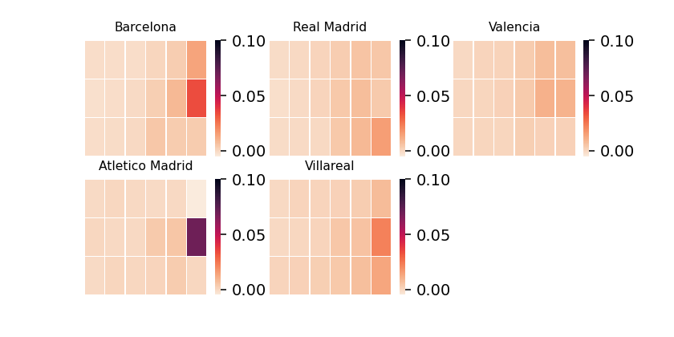
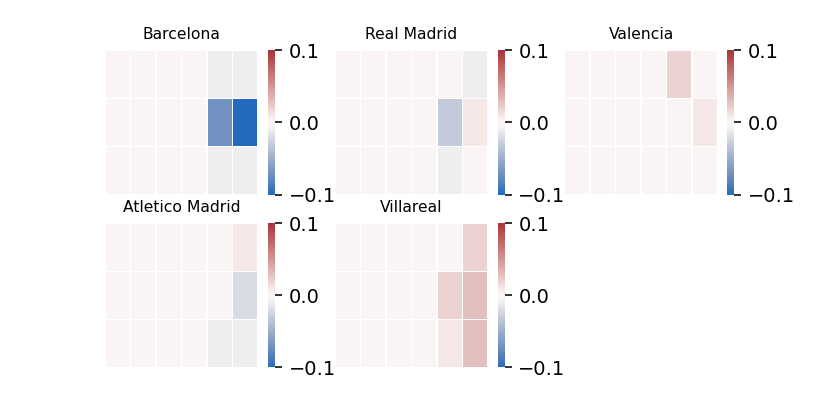
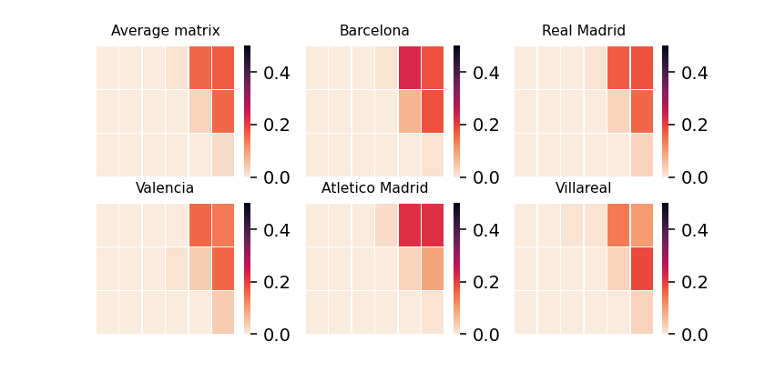
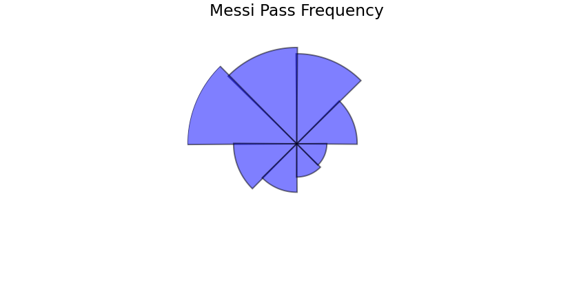
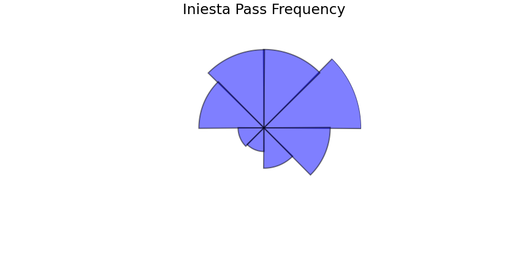
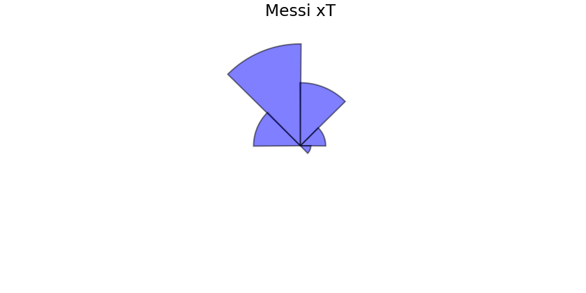
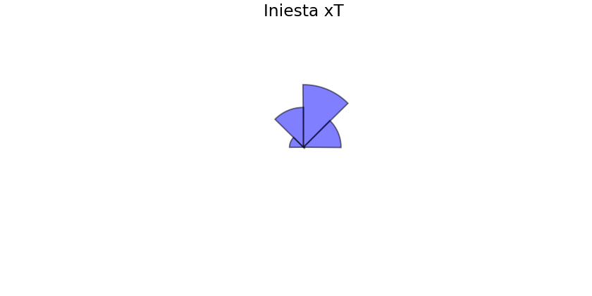

# Expected-Threat-and-more

Deriving Expected threat, introduced by Karun Singh in his blog post. Using this metric to further visualise the difference between top 5 teams in the La-Liga 2017-2018 season. 

## xT Deviation from average -

**Atletico Madrid creates more threat than average in front of the goal whereas Real Madrid is slightly more efficient from the right hand side**

## Frequency of shots - 

**Barcelona are hesitant to shoots even when in front of the goal. Whereas Valencia and Villareal take more shots from zones which have a lower probability of a goal being scored.**

## Transition Matrix for the top right corner

**Barcelona tend to play short passes instead of putting in crosses, whereas Real Madrid and Villareal tend to cross the ball into the box more.**

# Pass Sonars

## Pass Frequency

Pass sonars help to visualise pass direction and individual player pass trends. 

**Here the bar lenghts are absolute, Busquets creates lesser threat than Messi owing to his role in the team.

## Expected Threat 

**Bar Length equals the xT generated from the passes in this direction.

**Iniesta creates lesser threat than Messi**

